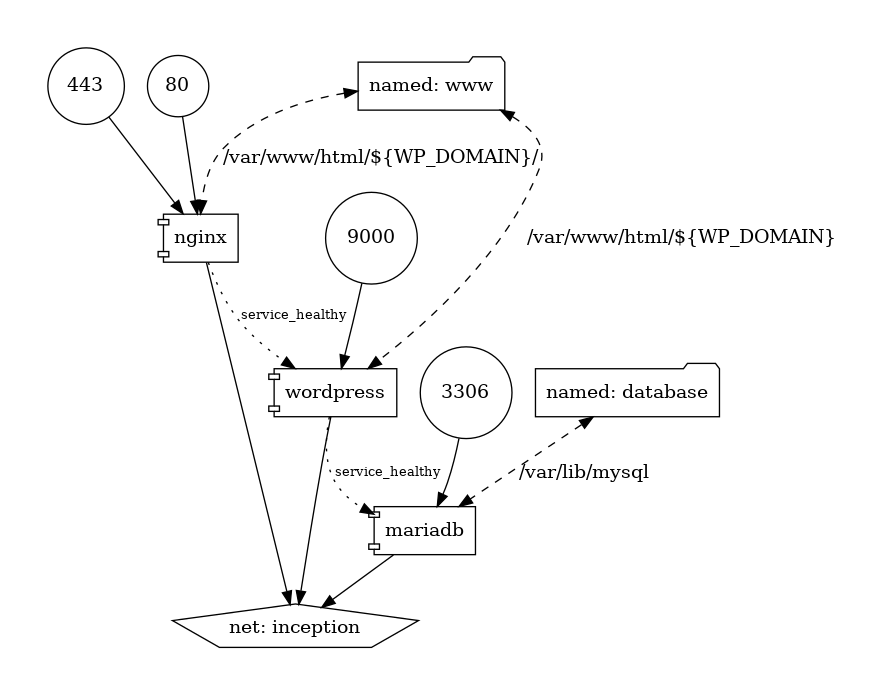
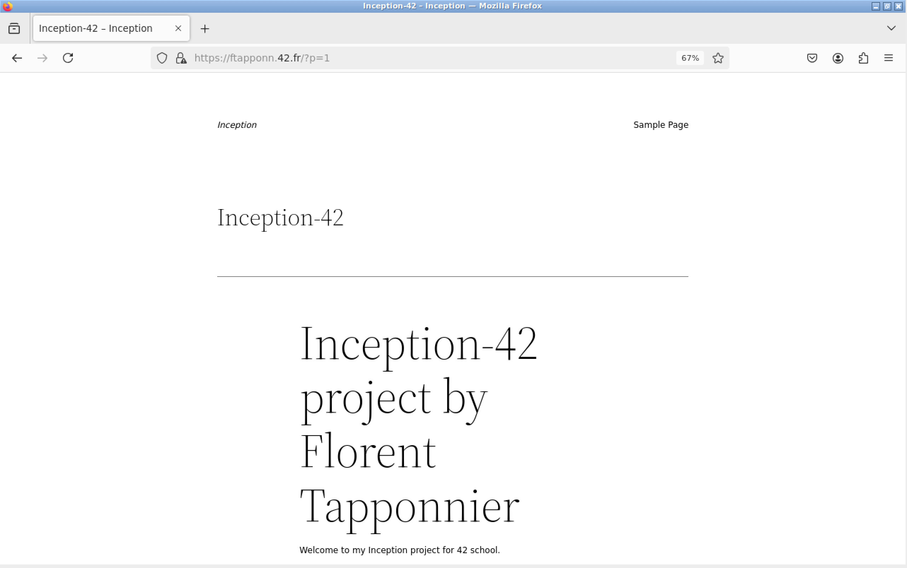

# inception 42 

This project at 42 is a web development project where you will deploy a WordPress site using Docker. 
The goal is to work with Docker containers for Nginx (as a reverse proxy), MariaDB (as the database), and WordPress (as the CMS).

## Docker & Docker Compose

__What is Docker?__
Docker is a platform that enables developers to package applications and their dependencies into containers. 
These containers can run anywhere, providing a consistent environment for the application across different systems. 
Each container is isolated and can be used to run software, tools, and services needed for your project.

__What is Docker Compose?__
Docker Compose is a tool that allows you to define and manage multi-container Docker applications. Using a docker-compose.yml file, you can configure the services, networks, and volumes needed for your application. It makes it easy to orchestrate multiple containers working together as one unit.

## Setting Up the Project

1. Go to the Project Directory
Once you've cloned the repository for the project, navigate to the project directory via terminal:

```sh
cd project
```
2. Compile with Make
In this project, you can use the Makefile to automate the build process. To compile everything, simply run:

```sh
make
```
## Architecture :

```sh
├── Makefile
└── srcs
    ├── docker-compose.yml
    └── requirements
        ├── mariadb
        │   ├── conf
        │   │   └── 50-server.cnf
        │   ├── Dockerfile
        │   └── tools
        │       └── mariadb.sh
        ├── nginx
        │   ├── conf
        │   │   └── nginx.conf
        │   └── Dockerfile
        └── wordpress
            ├── conf
            │   └── www.conf
            ├── Dockerfile
            └── tools
                └── wordpress.sh
```
__Makefile__: This file is used to automate the build and setup process for the entire project. It typically contains commands to compile and deploy the containers.

__srcs/docker-compose.yml:__ This is the main configuration file for Docker Compose. It defines how the containers (Nginx, MariaDB, WordPress) interact with each other, including their configuration, environment variables, ports, and networking.

__requirements:__ The requirements folder contains the setup files for each individual service (MariaDB, Nginx, WordPress) that you will be using in the project.

__mariadb:__

__conf/50-server.cnf:__ Configuration file for MariaDB server settings.

__Dockerfile:__ Defines how the MariaDB container is built, including installing the required dependencies and copying necessary configuration files.

__tools/mariadb.sh:__ A shell script used to initialize the MariaDB database or perform additional setup tasks when the container starts.

__nginx:__

__conf/nginx.conf:__ Configuration file for Nginx, specifying how the server should handle incoming requests, proxy to the WordPress container, and serve static files.

__Dockerfile:__ Defines how to build the Nginx container, including installing dependencies and setting up the custom Nginx configuration.

__wordpress:__

__conf/www.conf:__ Configuration file for PHP-FPM settings to manage the PHP processes for WordPress.

__Dockerfile:__ Defines how to build the WordPress container, setting up PHP and the WordPress environment.

__tools/wordpress.sh:__ A shell script used to set up or configure WordPress inside the container.

## Docker Components in the Project
This project involves three main components running in separate Docker containers:

__1. Nginx (Reverse Proxy)__
Nginx is a lightweight web server and reverse proxy server. In this project, it acts as a reverse proxy to handle incoming HTTP requests and forward them to the appropriate container (e.g., WordPress container). Nginx also handles static files like images, CSS, and JavaScript.

The Nginx configuration usually includes a setup to route requests to WordPress and also serve static content.

__2. MariaDB (Database)__
MariaDB is an open-source database management system. It is used in this project to store all of the WordPress data, including posts, pages, comments, and user information. The MariaDB container will be configured with the required credentials for WordPress to access the database.

__3. WordPress (CMS)__
WordPress is the content management system (CMS) used for this project. It’s responsible for displaying the website and managing the content. The WordPress container is configured to connect to the MariaDB database, allowing it to save and retrieve data.

__Docker and Docker Compose Files__

## Dockerfile
A Dockerfile is a text file that contains instructions on how to build a Docker image. Each instruction defines a step that is executed to install software, copy files, and configure the environment inside the container.


## docker-compose.yml
The docker-compose.yml file defines how the different services (containers) work together in the Docker environment. It includes details such as which images to use, container ports, environment variables, and how containers are linked.


How the Docker Compose Works
Services: Each part of the application (Nginx, MariaDB, WordPress) is defined as a service.

__Ports:__ Containers expose ports so they can be accessed from outside the container. For example, Nginx listens on port 80, and WordPress listens on port 8080.

__Volumes:__ Volumes store persistent data, like the database and WordPress content. They ensure data isn't lost when containers are restarted.

__Networks:__ Containers are connected to the same network to allow communication between them. In this case, all services are on the wordpress_net network.

__.env :__ The .env file is used to define environment variables that configure the application, such as database credentials, API keys, and other sensitive information, allowing you to easily manage and secure your project's settings.

__result after docker-compose up command and accessing to ftapponn.42.fr :__


## Conclusion
Using Docker and Docker Compose in this project allows for easy deployment and management of the WordPress website with its associated services (Nginx and MariaDB). 
Docker isolates each component in its container, ensuring consistency across different environments, while Docker Compose makes it easy to manage multiple containers at once with a single command (docker-compose up).
By using these tools, you can efficiently set up and maintain your web development environment, allowing for easier scaling and management of services.


